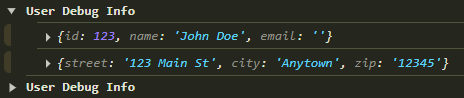
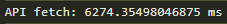
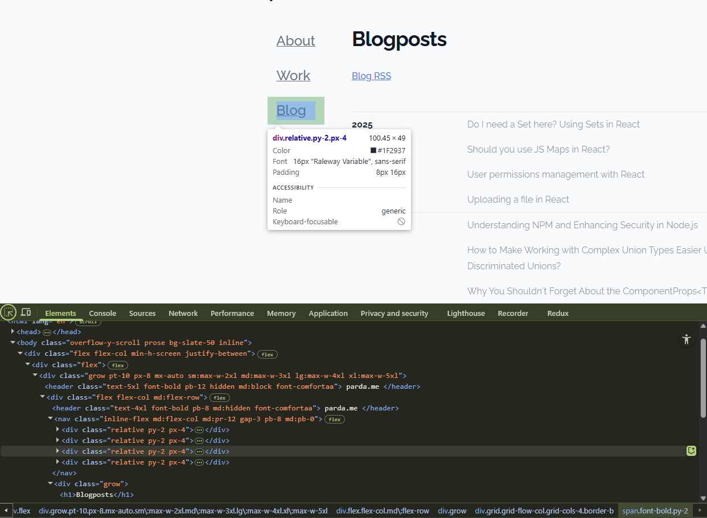
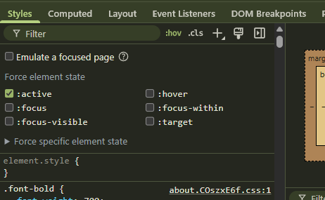
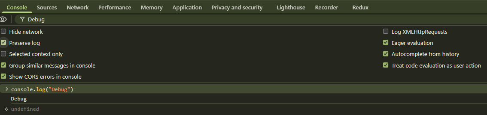
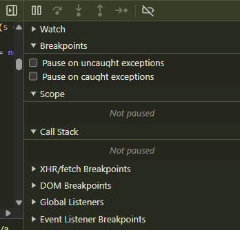

Debugging is one of the most important skills you develop as a React developer. It’s something that separates a smooth developer experience (and happier users) from hours of confusion staring at misbehaving UI. Over dozens of shipped projects, I’ve developed a set of go-to strategies—ranging from print debugging to fancy profiling and tool-assisted time-travel—that help me track down and squash bugs efficiently. In this post, I’ll walk through how I actually debug my React apps, from simple techniques to advanced workflows.

## Table of Contents

- [Console Logging](#console-logging)
- [Custom Logger for Environment-based Debugging](#custom-logger-for-environment-based-debugging)
- [Using Browser DevTools](#using-browser-devtools)
- [React Developer Tools](#react-developer-tools)
- [Debugging in VS Code](#debugging-in-vs-code)
- [Error Boundaries for Graceful Recovery](#error-boundaries-for-graceful-recovery)
- [Performance Profiling](#performance-profiling)
- [Test-Driven Debugging](#test-driven-debugging)
- [Redux State Debugging](#redux-state-debugging)
- [Conclusion](#conclusion)

## Console Logging - first line of defense

Nothing beats good old `console.log()` for first-line debugging. Logging is especially useful in React because it helps you observe how values change on each render, in event handlers, or even outside your component tree (i.e. right inside your module imports).

### **Basic Console Logging Examples**

#### console.log()

```javascript
// Inside a component function
function MyComponent({ user }) {
  console.log("Renders with user:", user);
  // ...
}
```

When you log inside a component, it will print every time the component renders. This is great for tracking state changes or prop updates.

```javascript
// Inside an event handler
function handleClick() {
  console.log("Button clicked");
  // Handle click logic
}
```

Event handlers are another common place to log. This helps you see when actions occur and what data is being passed around.

```javascript
// Outside a component
import { useEffect } from "react";
console.log("App loaded");
function App() {
  // App code
}
```

Logging outside a component (e.g., at the module level) is useful for one-time initialization messages or debugging imports.

"Trick" I like to use is when I have a lot of values to log in browser console I do:

```javascript
console.log("User data:", {
  userId: user.id,
  userName: user.name,
  userEmail: user.email,
});
```

This way, I can expand the logged object in the console to see all properties at once, rather than logging each one separately. And I can easily find it with "User data:" string.

#### console.warn() & console.error()

For better severity separation, use:

- `console.warn()` for things that aren’t fatal but might indicate a problem
- `console.error()` for actual error states

### **Advanced Console Logging**

The console API is richer than many realize:

- `console.table(data)`  
  Great for displaying arrays of objects as a table.

- `console.group()` and `console.groupEnd()`  
  Group related logs for easier scanning:

  ```javascript
  console.group("User Debug Info");
  console.log(user);
  console.log(address);
  console.groupEnd();
  ```

  Web browser output, group collapsed and expanded.
  

- `console.time()` and `console.timeEnd()`  
   Quick performance timings:

  ```javascript
  console.time("API fetch");
  await fetchData();
  console.timeEnd("API fetch");
  ```

  Web browser output, time taken to fetch data.
  

_When logging gets frequent or noisy, it’s time to start thinking about a custom logger…_

## Custom Logger for Environment-based Debugging

Hard-coding logs everywhere gets messy, especially when moving between dev, QA, and prod environments. I like to wrap my logs in a simple env-aware logger that only prints when it makes sense:

```javascript
const logger = {
  debug: (message, ...args) => {
    if (["local", "dev", "qa"].includes(process.env.NODE_ENV)) {
      console.log(`[DEBUG] ${message}`, ...args);
    }
  },
  warn: (message, ...args) => {
    if (["local", "dev", "qa"].includes(process.env.NODE_ENV)) {
      console.warn(`[WARNING] ${message}`, ...args);
    }
  },
  error: (message, ...args) => {
    if (["local", "dev", "qa"].includes(process.env.NODE_ENV)) {
      console.error(`[ERROR] ${message}`, ...args);
    }
  },
};

// Usage
logger.debug("User logged in", { userId: 123, timestamp: Date.now() });
logger.warn("API response slow", { endpoint: "/users", responseTime: 2000 });
logger.error("Failed to fetch data", new Error("Network error"));
```

This helps keep the production console clean, while you still get all the info you need in dev. Besides it give you a simple way of finding logs in the console, since they all start with `[DEBUG]`, `[WARNING]`, or `[ERROR]`.

## Using Browser DevTools

The browser is your React app’s runtime environment, and its DevTools are some of the most powerful debugging resources. I will describe briefly few features that I use most often.

### **Elements Tab**

- Visualize and inspect the full DOM, see component output, active classes, styles, inline changes.
  
- Quickly tweak CSS, toggle pseudo-states (`:hover`, `:focus`), and experiment with changes before moving to source.
  

### **Console Tab**

- View logs (and preserve them even after reloads).
- Filter by log levels or sources—if you’re using a custom logger, this is especially helpful.
  

### **Network Tab**

- Inspect API requests/responses in detail.
- **Performance debugging**: Track time-to-first-byte, how long requests are taking, or find missing/broken calls.
- **Response overrides**:  
  Modify API responses _on the fly_:

  1. Open Network Tab
  2. Right-click a request → “Override content”
  3. Adjust the response (e.g., inject an error)
  4. Refresh the page (or refetch on edited request)
  5. Apply and see how your app handles the new scenario

  This is invaluable for testing error handling and edge-case flows.

### **Sources Tab**

- Set breakpoints, step line-by-line through your code execution, access source maps for easier navigation.
  

## React Developer Tools

React DevTools is a must-have for any React workflow. It gives you superpowers missing in vanilla browser tools.

### **Components Tab**

- Visualize your full component tree (including hierarchy, props, hooks, and local state).
- **Edit state and props live!** Tweak values to see how your UI updates. Great for testing without a full backend.
- Investigate which components are re-rendering and why.

### **Profiler Tab**

- Record and analyze why (and how often) components rerender.
- Spot wasted or unnecessary renders—fix with `React.memo`, `useCallback`, `useMemo`, or context refactoring.
- Use “Highlight updates when components render” to instantly see what React thinks is changing.

React 19+ tools continue improving. Make sure your devtools extension is up-to-date for access to the latest features.

## Debugging in VS Code

Many React projects run in VS Code, and its debugging support is impressive once you configure it.

### **Launch Configuration**

By setting up a `launch.json` you can use VS Code’s built-in debugger:

```json
{
  "version": "0.2.0",
  "configurations": [
    {
      "type": "chrome",
      "request": "launch",
      "name": "Debug React App",
      "url": "http://localhost:3000",
      "webRoot": "${workspaceFolder}/src"
    }
  ]
}
```

This allows you to:

- Set breakpoints directly in your React source (not just the built bundle)
- Use “step over”, “step into”, and “step out” for fine-grained control over code execution
- Watch variable values and inspect call stacks

**Pro tip:** Use conditional breakpoints (right-click, “Edit breakpoint...”) to pause only for certain variable values—awesome for hunting one-off behavior in loops/lists.

## Error Boundaries for Graceful Recovery

React’s error boundaries are your last line of defense against unhandled exceptions blowing up your entire app. They let you catch errors in child components, log them, and provide a fallback UI:

```jsx
import { Component, ErrorInfo, ReactNode } from "react";

interface ErrorBoundaryProps {
  fallback: ReactNode;
  children: ReactNode;
}

interface ErrorBoundaryState {
  hasError: boolean;
}

class ErrorBoundary extends Component<ErrorBoundaryProps, ErrorBoundaryState> {
  constructor(props: ErrorBoundaryProps) {
    super(props);
    this.state = { hasError: false };
  }

  static getDerivedStateFromError(_: Error): ErrorBoundaryState {
    return { hasError: true };
  }

  componentDidCatch(error: Error, errorInfo: ErrorInfo) {
    console.error("Error caught by boundary:", error, errorInfo);
  }

  render() {
    if (this.state.hasError) {
      return this.props.fallback;
    }
    return this.props.children;
  }
}

// Usage
const App = () => (
  <ErrorBoundary fallback={<h1>Something went wrong</h1>}>
    <MyComponent />
  </ErrorBoundary>
);
```

From React 19 onwards, error boundaries have improved their integration with modern Suspense/data loading flows. Still, I recommend a _global_ error boundary at the top of your app—and local ones for error-prone UI islands.

## Performance Profiling

### React Profiler API

For fine-grained performance tuning (beyond logging), use the `<Profiler>` component to measure render timings for specific component trees:

```jsx
import React, { Profiler } from "react";

function onRenderCallback(
  id, // the "id" prop of the Profiler tree that has just committed
  phase, // either "mount" or "update"
  actualDuration, // time spent rendering the committed update
  baseDuration,
  startTime,
  commitTime,
) {
  console.log(`${id} [${phase}] render: ${actualDuration}ms`);
}

<Profiler id="MyList" onRender={onRenderCallback}>
  <MyList />
</Profiler>;
```

If your app feels slow, incrementally "profile" individual components until you find and optimize the bottleneck.

## Test-Driven Debugging

Sometimes the best debugging is _preventing_ bugs in the first place. Writing unit and integration tests helps catch errors early and provides a quick, repeatable way to validate fixes.

- **Jest + React Testing Library** is my standard stack for React:

```jsx
import { render, screen } from "@testing-library/react";
import MyComponent from "./MyComponent";

test("renders correct content", () => {
  render(<MyComponent />);
  const element = screen.getByText(/expected text/i);
  expect(element).toBeInTheDocument();
});
```

New bug surfaced? Add a test to cover it _before_ attempting a fix. Not only does this help avert regressions, but it shortens future debugging effort.

## Redux State Debugging

If you use Redux (including Redux Toolkit), [Redux DevTools Extension](https://redux.js.org/usage/middleware#the-redux-devtools-extension) is a must install.

- Step through every action and see exactly how state changes over time.
- **Time-travel debugging**: rewind/fast-forward dispatched actions to isolate where breakdowns start.
- Compare previous and next state at each action—far easier than scattering log statements everywhere.

## Conclusion

Mastering React debugging is a journey—not just a list of tools, but an approach: start simple, work your way up. Use logs to spot quick issues, DevTools to understand structure and data flow, profilers for optimizing performance, error boundaries for resilience, and tests for prevention.

Every app is different; the best debuggers tailor their workflow—but these tips will cover the vast majority of bugs you’ll encounter. Happy debugging!

<div align="center">

_Got your own favorite debugging tricks? Share them below! 🚀_

</div>
